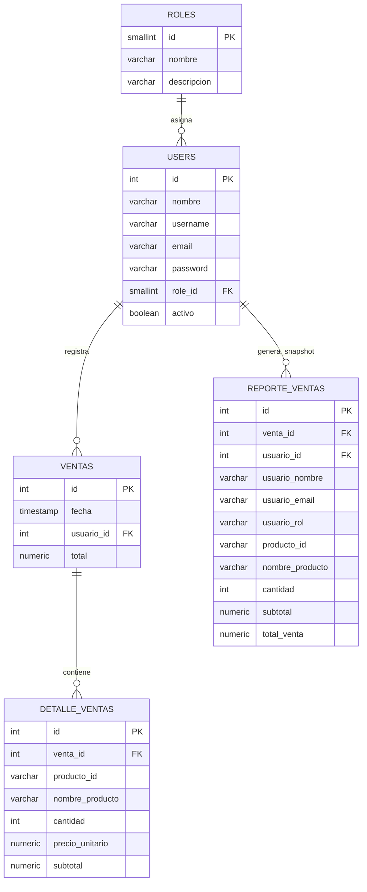

# Documentación Técnica Completa - ProyectoWeb

## 1) Resumen Ejecutivo

ProyectoWeb es un monorepo con arquitectura híbrida de datos y separación por capas en backend.

- Backend principal: Node.js + Express (`node-api`)
- Frontend alternativo: Flask (`frontend`)
- Productos: MongoDB (Mongoose)
- Usuarios/roles/ventas/reportes: PostgreSQL (`pg`)
- Despliegue: Render

El sistema soporta:
- Registro e inicio de sesión con JWT
- Gestión de usuarios por rol ADMIN
- Gestión de productos (crear, aumentar stock, desactivar/reactivar)
- Registro de ventas por VENDEDOR
- Consulta de ventas/KPIs/reportes por CONSULTOR
- Exportación CSV por usuario desde consultor
- Vistas responsive para escritorio, tablet y teléfono
- Bootstrap automático de esquema y datos iniciales en primer arranque

---

## 2) Arquitectura General

## 2.1 Monorepo

- `node-api/`: API REST + páginas web server-side (templates HTML en `public/templates`)
- `frontend/`: cliente Flask adicional (puede usarse como frontend alterno)
- `render.yaml`: blueprint para despliegue del backend Node en Render
- `README.md` y `DEPLOYMENT.md`: guías base

## 2.2 Arquitectura por capas (backend Node)

En `node-api/src`:

- `routes/`: define endpoints
- `controllers/`: entrada/salida HTTP
- `services/`: reglas de negocio
- `repositories/`: acceso a datos
- `middleware/`: JWT y autorización por rol
- `validators/`: validación de payloads (Joi)
- `config/`: conexión de base de datos
- `models/`: modelos Mongoose (productos)

Patrón aplicado: **Route -> Controller -> Service -> Repository -> DB**

---

## 3) Stack Tecnológico

## 3.1 Backend

- Node.js
- Express
- `jsonwebtoken` (JWT)
- `bcrypt` (hash de contraseña)
- `joi` (validación)
- `mongoose` (MongoDB)
- `pg` (PostgreSQL)
- `cors`, `dotenv`, `cookie-parser`

## 3.2 Frontend

- HTML + Bootstrap 5 (en `node-api/public/templates`)
- Frontend alterno Flask (`frontend/app.py`) con templates y `requests`

## 3.3 Bases de datos

- MongoDB Atlas: productos
- PostgreSQL (Render): roles, users, ventas, detalle de ventas, reporte_ventas

---

## 4) Modelo de Datos

## 4.1 MongoDB (Productos)

Colección `productos` (Mongoose):
- `nombre`
- `descripcion`
- `precio`
- `categoria`
- `stock`
- `activo`

Uso principal:
- Catálogo de productos
- Búsqueda y filtrado por categoría
- Control de stock

## 4.2 PostgreSQL (Seguridad, operación y reportes)

Tablas definidas en `node-api/sql/schema_operativo_productos_ventas.sql`:

- `roles`
  - `id SMALLSERIAL PK`
  - `nombre`, `descripcion`

- `users`
  - `id SERIAL PK`
  - `nombre`, `username`, `email`, `password`
  - `role_id` FK `roles(id)`
  - `activo`
  - timestamps

- `ventas`
  - `id SERIAL PK`
  - `fecha`
  - `usuario_id` FK `users(id)`
  - `total`
  - timestamps

- `detalle_ventas`
  - `id SERIAL PK`
  - `venta_id` FK `ventas(id)`
  - `producto_id` (ObjectId de Mongo serializado como texto)
  - `nombre_producto`, `cantidad`, `precio_unitario`, `subtotal`

- `reporte_ventas`
  - tabla de snapshot para análisis/reporting
  - incluye `usuario_id`, `usuario_nombre`, `usuario_email`, `usuario_rol`
  - incluye `producto_id`, producto, subtotal y total venta

Además existe `node-api/sql/schema_postgres.sql` para escenarios donde se quiere preparar únicamente `roles`, `users` y `reporte_ventas`.

---

## 4.3 Diagrama ER



## 5) Flujo de Seguridad y Roles

1. Usuario se registra -> queda pendiente de rol
2. ADMIN asigna rol
3. Usuario inicia sesión
4. Se genera JWT con `id` y `rol`
5. Middleware `verifyToken` valida token
6. Middleware `authorize(...)` restringe acceso por rol

Roles:
- `ADMIN`: administración de usuarios y productos
- `VENDEDOR`: registra ventas y consulta ventas permitidas
- `CONSULTOR`: consulta reportes y exporta CSV

---

## 6) Módulos Funcionales

## 6.1 Auth y Usuarios

Endpoints:
- `POST /api/auth/register`
- `POST /api/auth/login`
- `PUT /api/admin/asignar-rol` (ADMIN)
- `GET /api/admin/users` (ADMIN)
- `GET /api/admin/all-users` (ADMIN)
- `DELETE /api/admin/users/:id` (ADMIN)

## 6.2 Productos

Endpoints:
- `GET /api/productos` (ADMIN/VENDEDOR/CONSULTOR) -> solo activos
- `GET /api/productos/admin/todos` (ADMIN) -> activos + inactivos
- `GET /api/productos/search/:keyword`
- `GET /api/productos/categoria/:categoria`
- `GET /api/productos/:id`
- `POST /api/productos` (ADMIN) -> crea nuevo producto (ObjectId Mongo)
- `PUT /api/productos/:id` (ADMIN)
- `PATCH /api/productos/:id/stock` (ADMIN) -> incrementa stock
- `PATCH /api/productos/:id/reactivar` (ADMIN) -> activa producto + agrega stock
- `DELETE /api/productos/:id` (ADMIN) -> desactivación lógica (`activo=false`)

Regla aplicada:
- Si `stock = 0`, no se muestra para venta en panel vendedor.

## 6.3 Ventas

Endpoints:
- `GET /api/ventas`
- `GET /api/ventas/:id`
- `POST /api/ventas` (ADMIN/VENDEDOR)
- `DELETE /api/ventas/:id` (ADMIN)

Comportamiento clave en registro de venta:
- Reserva de stock en MongoDB por producto
- Transacción SQL (`BEGIN ... COMMIT/ROLLBACK`) para ventas y reportes
- Compensación de stock en MongoDB si la persistencia SQL falla
- Inserción en `ventas` y `detalle_ventas`
- Inserción de snapshot enriquecido en `reporte_ventas`

## 6.4 Consultoría y Reportes

Panel consultor incluye:
- KPIs (ventas totales, ingresos, productos activos)
- filtros por fecha y `usuario_id`
- exportación CSV por usuario (desde filtro)

---

## 7) Vistas y UX (Node templates)

Ubicación: `node-api/public/templates`

Vistas principales:
- `login.html`, `register.html`, `espera_rol.html`
- `admin_redirect.html`, `admin_users.html`, `admin_productos.html`
- `vendedor.html`
- `consultor.html`

Estado actual:
- Redirecciones por rol funcionales
- Flujo completo de ventas/productos/admin funcional
- Ajustes responsive aplicados para móvil y tablet

---

## 8) Historial de Migraciones y Decisiones Técnicas

Durante el desarrollo se pasó por estas fases:

1. Implementación inicial de productos/ventas
2. Intento de migración amplia a SQL
3. Primera arquitectura híbrida:
   - usuarios/auth/admin en MongoDB
   - productos/ventas/reportes en PostgreSQL
4. Rediseño actual:
   - productos quedan en MongoDB
   - usuarios, roles, ventas y reportes pasan a PostgreSQL
5. Ajustes de compatibilidad:
   - `roles` se modela como entidad separada
   - `producto_id` queda como referencia textual al ObjectId de Mongo
6. Creación de scripts de soporte:
   - `schema_operativo_productos_ventas.sql`
   - `seed_productos.sql` (histórico)
   - `seedProductosMongo.js`
7. Mejoras de funcionalidad:
   - gestión de stock por ADMIN
   - desactivar/reactivar producto con cantidad
   - exportación CSV en consultor
8. Ajustes responsive en todas las vistas activas

---

## 9) Despliegue en Render

## 9.1 Backend Node (con `render.yaml`)

Variables esperadas:
- `NODE_ENV=production`
- `PORT=10000`
- `MONGO_URI`
- `DATABASE_URL`
- `PGHOST`, `PGPORT`, `PGDATABASE`, `PGUSER`, `PGPASSWORD`
- `PGSSLMODE=require`
- `JWT_SECRET`

## 9.2 Frontend Flask (opcional como servicio separado)

Variables:
- `API_BASE`
- `FLASK_SECRET`

## 9.3 Pasos de bootstrap DB en PostgreSQL

Orden recomendado en producción nueva:

1. Configurar `DEFAULT_ADMIN_PASSWORD`.
2. Hacer deploy del backend.
3. Dejar que el arranque ejecute bootstrap automático.

Comportamiento del bootstrap:

- Ejecuta `schema_operativo_productos_ventas.sql` automáticamente al arrancar.
- Si `users` está vacía, crea un admin inicial.
- Si `productos` está vacía en MongoDB, inserta el catálogo base.

Validación:

```sql
SELECT COUNT(*) AS total_users FROM users;
SELECT COUNT(*) AS total_roles FROM roles;
```

---

## 10) Scripts y Operación Local

## 10.1 Backend Node

```bash
cd node-api
npm install
npm run dev
```

Seed de admin (PostgreSQL, opcional):

```bash
npm run seed
```

Seed de productos (MongoDB):

```bash
npm run seed:productos
```

## 10.2 Frontend Flask (opcional)

```bash
cd frontend
python -m venv venv
venv\Scripts\activate
pip install -r requirements.txt
python app.py
```

---

## 11) Variables de Entorno

## 11.1 `node-api/.env`

- `PORT`
- `MONGO_URI`
- `DATABASE_URL`
- `PGHOST`
- `PGPORT`
- `PGDATABASE`
- `PGUSER`
- `PGPASSWORD`
- `PGSSLMODE`
- `DEFAULT_ADMIN_NAME`
- `DEFAULT_ADMIN_USERNAME`
- `DEFAULT_ADMIN_EMAIL`
- `DEFAULT_ADMIN_PASSWORD`
- `JWT_SECRET`

## 11.2 `frontend/.env` (si aplica)

- `API_BASE`
- `FLASK_SECRET`

---

## 12) Mantenimiento y Buenas Prácticas

1. Rotar credenciales si fueron expuestas en chats/logs.
2. Mantener scripts SQL versionados.
3. Ejecutar seeds idempotentes (`ON CONFLICT`) para catálogos.
4. No usar `force push` en ramas compartidas.
5. Probar flujo por rol después de cada deploy:
   - registro -> asignación rol -> login -> operación por panel.
6. Monitorear logs Render tras despliegue.

---

## 13) Checklist de QA (recomendado)

## 13.1 Tabla de historias de usuario

| ID | Historia | Actor | Criterio principal |
|----|----------|-------|--------------------|
| HU-01 | Registrarse en la plataforma | Usuario | El usuario se guarda en PostgreSQL con rol `PENDIENTE` |
| HU-02 | Asignar rol a un usuario | Admin | El rol se actualiza desde la tabla `roles` |
| HU-03 | Iniciar sesión según rol | Usuario | El JWT refleja `id` y `rol` de PostgreSQL |
| HU-04 | Gestionar catálogo de productos | Admin | Los productos se crean y actualizan en MongoDB |
| HU-05 | Registrar venta con stock válido | Vendedor | La venta queda en PostgreSQL y el stock baja en MongoDB |
| HU-06 | Consultar KPIs y exportar CSV | Consultor | Los reportes salen de PostgreSQL |

- Auth:
  - Registro ok
  - Login ok
  - Usuario sin rol recibe bloqueo
- Admin usuarios:
  - Asignar rol funciona
  - Eliminar usuario funciona
- Admin productos:
  - Crear producto funciona
  - Agregar stock funciona
  - Desactivar funciona
  - Reactivar pide cantidad y funciona
- Vendedor:
  - No ve productos con stock 0
  - Venta descuenta stock
- Consultor:
  - KPIs cargan
  - Filtros funcionan
  - CSV por usuario se descarga
- DB:
  - `roles`, `users`, `ventas`, `detalle_ventas`, `reporte_ventas` existen en PostgreSQL
  - La colección `productos` existe en MongoDB

---

## 14) Estado Actual del Proyecto

Estado: **Funcional en escritorio, tablet y móvil**, con arquitectura híbrida estabilizada y flujos críticos operativos.

Si se desea avanzar a siguiente fase, recomendaciones:
- agregar pruebas automatizadas de API (supertest/jest)
- agregar auditoría de acciones admin
- agregar paginación y búsqueda avanzada en tablas grandes
- agregar recuperación de contraseña y refresh token
